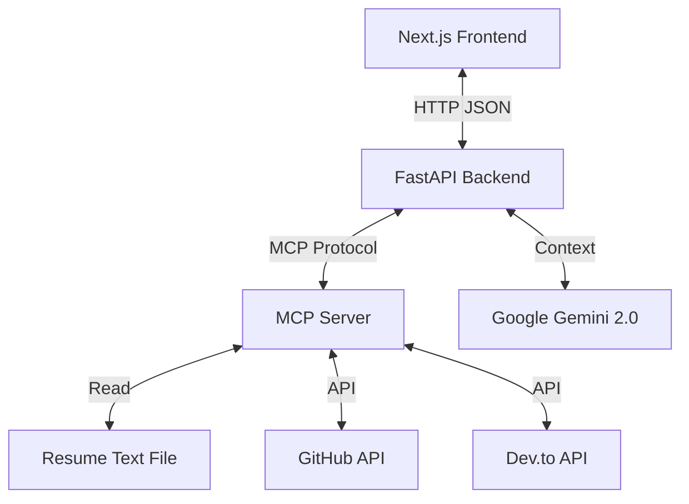

# 🤖 AI Portfolio Agent (MCP + Gemini 2.0)

> A Full-Stack AI Agent that lives on my portfolio website. It uses the **Model Context Protocol (MCP)** to fetch real-time data about my skills, GitHub projects, and blog posts using Google's Gemini 2.0 Flash.

## 🚀 How It Works

Unlike a standard chatbot that hallucinates answers, this Agent has **"Tools"**. When you ask a question, the AI decides which tool to use, fetches real data from my accounts, and summarizes it for you.

**Architecture:**


## ✨ Features

-   **🧠 Powered by Gemini 2.0 Flash:** Ultra-fast reasoning and context understanding.
-   **🛠 MCP (Model Context Protocol):** Modular tool system separating logic from the AI model.
-   **📂 Real-time Resume Parsing:** Reads `my_profile.txt` to answer questions about experience/education.
-   **🐙 Live GitHub Integration:** Fetches my latest pinned/updated repositories dynamically.
-   **✍️ Dev.to Blog Fetcher:** Retrieves my latest technical articles.
-   **🔌 FastAPI Bridge:** Exposes the local MCP server as a web API for the frontend.

## 🛠️ Tech Stack

*   **Backend:** Python 3.12+, FastAPI, Uvicorn
*   **AI Logic:** Google Generative AI (Gemini), Model Context Protocol (MCP)
*   **APIs:** PyGithub, HTTPX (for Dev.to)
*   **Frontend:** Next.js, Tailwind CSS, Lucide React (Chat Widget)

---

## ⚙️ Setup & Installation

### 1. Prerequisites
*   Python 3.10 or higher
*   A Google Gemini API Key (Free via Google AI Studio)
*   A GitHub Personal Access Token (Optional, for higher rate limits)

### 2. Clone the Repository
```bash
git clone https://github.com/Chauhan-yuvraj/mcp-for-portfolio.git
cd mcp-for-portfolio
```

### 3. Install Dependencies
```bash
pip install "mcp[cli]" google-generativeai fastapi uvicorn PyGithub httpx python-dotenv
```

### 4. Configure Environment
Create a `.env` file in the root folder and add your keys:

```ini
GOOGLE_API_KEY=your_gemini_api_key_here
GITHUB_TOKEN=your_github_token_here
# DEV_TO_USER=your_username (Optional, defaults in code)
```

### 5. Update Profile Data
Edit the `my_profile.txt` file in the root directory. This is the "Brain" of the bot regarding your personal history.

```text
[OVERVIEW]
Name: Yuvraj
Role: Full Stack Developer
...
```

### 6. Run the Server
Start the FastAPI server (which automatically launches the MCP server):

```bash
uvicorn api:app --reload
```
*The server will start at `http://127.0.0.1:8000`*

---

## 🌐 API Documentation

The backend exposes a single endpoint for the Chat UI.

### `POST /chat`

**Request:**
```json
{
  "message": "What are your latest projects?"
}
```

**Response:**
```json
{
  "reply": "I recently built an MCP Agent and a Next.js Portfolio. You can check them out here..."
}
```

---

## 💻 Frontend Integration (Next.js)

To add the chat bubble to your Next.js portfolio:

1.  Create `components/ChatWidget.tsx`.
2.  Paste the component code (see `frontend-guide.md` or repo).
3.  Import it into your `layout.tsx`:

```tsx
import ChatWidget from "@/components/ChatWidget";

export default function RootLayout({ children }) {
  return (
    <html>
      <body>
        {children}
        <ChatWidget />
      </body>
    </html>
  );
}
```

---

## 🛡️ Troubleshooting

**1. `Connection Refused` / Backend Offline**
*   Ensure the Python server is running (`uvicorn api:app`).
*   Check if the Frontend is pointing to `http://127.0.0.1:8000/chat`.

**2. Gemini Error: `404 Model Not Found`**
*   Ensure you are using `gemini-2.0-flash` or `gemini-1.5-flash` in `api.py`.
*   Check your API Key in `.env`.

**3. CORS Errors (in Browser Console)**
*   If hosting the frontend, ensure `api.py` allows your Vercel domain in `CORSMiddleware`.

---

## 📄 License
This project is open-source and available under the MIT License.
